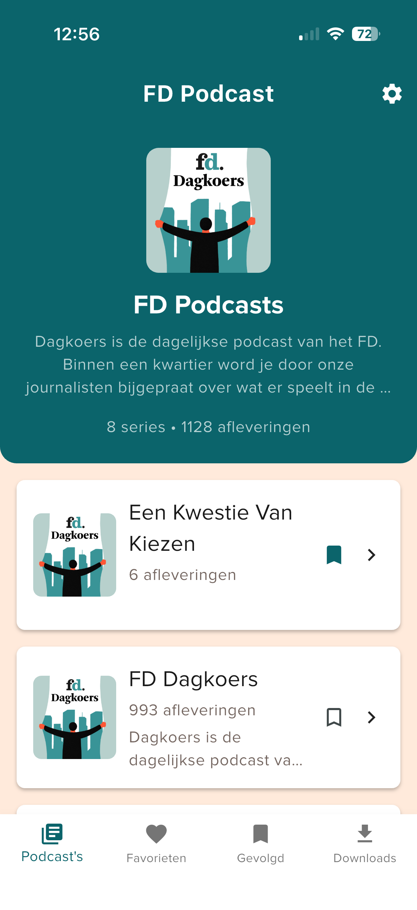
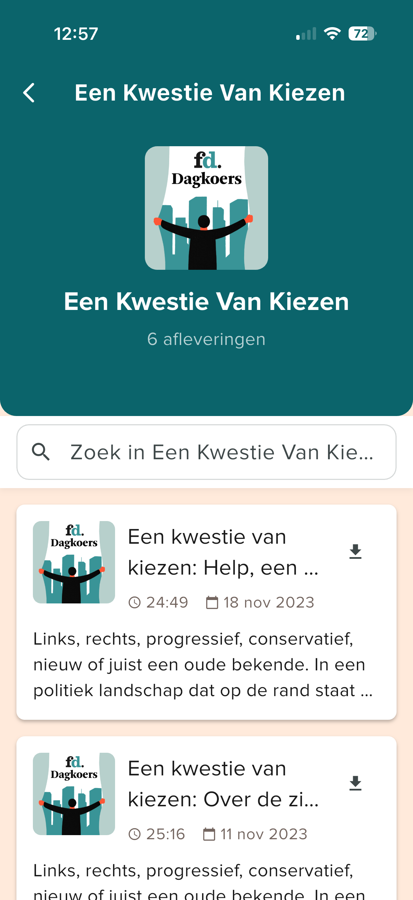
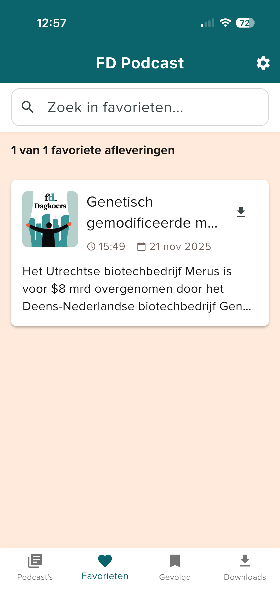
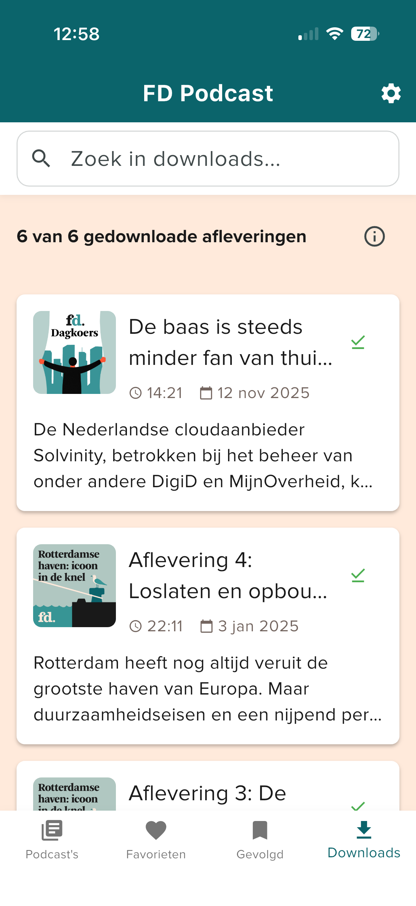
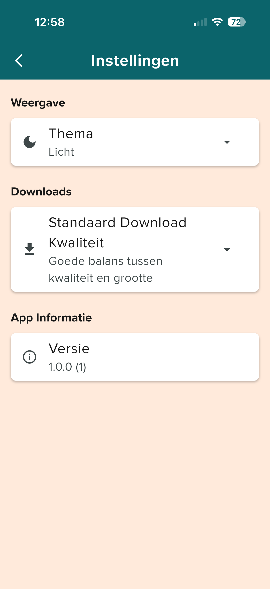

# FD Podcast

[🇬🇧 English](#english) | [🇳🇱 Nederlands](#nederlands)

---

<a name="english"></a>
## 🇬🇧 English

A modern Flutter podcast application for listening to and managing podcast episodes. Built with Flutter, this app provides a seamless experience for discovering, playing, downloading, and organizing your favorite podcast content.

## 📸 Screenshots

<div align="center">
  <table>
    <tr>
      <td align="center">
        
        <br />
        <sub><b>Home Screen</b></sub>
      </td>
      <td align="center">
        
        <br />
        <sub><b>Podcasts Screen</b></sub>
      </td>
      <td align="center">
        
        <br />
        <sub><b>Episode Detail</b></sub>
      </td>
    </tr>
    <tr>
      <td align="center">
        
        <br />
        <sub><b>Favorites Screen</b></sub>
      </td>
      <td align="center">
        
        <br />
        <sub><b>Followed Screen</b></sub>
      </td>
      <td align="center">
        
        <br />
        <sub><b>Downloads Screen</b></sub>
      </td>
    </tr>
    <tr>
      <td align="center" colspan="3">
        
        <br />
        <sub><b>Settings Screen</b></sub>
      </td>
    </tr>
  </table>
</div>

## 📱 Features

- **Podcast Discovery**: Browse and explore podcasts from RSS feeds
- **Audio Playback**: High-quality audio playback with background support
- **Download Management**: Download episodes for offline listening
- **Favorites**: Save your favorite episodes for quick access
- **Follow Series**: Follow podcast series to stay updated
- **Smart Alerts**: Get notified about new episodes automatically
  - **FD Dagkoers Alerts**: Automatic alerts for FD Dagkoers episodes published before 16:00
  - **Followed Podcast Alerts**: Notifications for new episodes in your followed series
- **Search**: Search through episodes and content
- **Modern UI**: Clean and intuitive Material Design interface
- **Multi-platform**: Supports iOS, Android, Web, macOS, Linux, and Windows

## 🚀 Getting Started

### Prerequisites

- Flutter SDK (3.10.0 or higher)
- Dart SDK (3.10.0 or higher)
- iOS: Xcode 13.0+ (for iOS development)
- Android: Android Studio with Android SDK (for Android development)
- CocoaPods 1.16.2+ (for iOS dependencies)

### Installation

1. **Clone the repository**
   ```bash
   git clone https://github.com/Livecast71/fd_flutter.git
   cd fd_flutter
   ```

2. **Install dependencies**
   ```bash
   flutter pub get
   ```

3. **Install iOS dependencies** (iOS only)
   ```bash
   cd ios
   pod install
   cd ..
   ```

4. **Run the app**
   ```bash
   flutter run
   ```

## 📦 Dependencies

### Core Dependencies
- `flutter` - Flutter SDK
- `http` (^1.2.0) - HTTP client for fetching RSS feeds
- `xml` (^6.4.2) - XML parsing for RSS feeds
- `intl` (^0.19.0) - Internationalization and date formatting
- `shared_preferences` (^2.2.2) - Local data persistence

### Audio & Media
- `just_audio` (^0.9.36) - Audio playback functionality
- `audio_service` (^0.18.11) - Background audio service
- `path_provider` (^2.1.1) - File system paths for downloads

### Permissions
- `permission_handler` (^11.3.0) - Handle device permissions

## 🏗️ Project Structure

```
lib/
├── main.dart                 # App entry point
├── models/                   # Data models
│   ├── episode.dart         # Episode model
│   ├── podcast.dart         # Podcast model
│   ├── program.dart         # Program model
│   └── series.dart          # Series model
├── screens/                  # App screens
│   ├── home_screen.dart     # Home screen
│   ├── main_tab_screen.dart # Main tab navigation
│   ├── downloads_screen.dart
│   ├── favorites_screen.dart
│   ├── followed_screen.dart
│   ├── programs_screen.dart
│   ├── series_screen.dart
│   └── episode_detail_screen.dart
├── services/                 # Business logic services
│   ├── rss_service.dart     # RSS feed parsing
│   ├── audio_player_service.dart
│   ├── download_service.dart
│   ├── favorites_service.dart
│   ├── followed_service.dart
│   ├── dagkoers_alert_service.dart  # FD Dagkoers alert functionality
│   └── followed_alert_service.dart  # Followed podcast alert functionality
├── widgets/                  # Reusable widgets
│   ├── audio_player_widget.dart
│   ├── mini_player_widget.dart
│   ├── episode_card.dart
│   ├── series_card.dart
│   ├── dagkoers_alert_dialog.dart      # FD Dagkoers alert dialog
│   ├── new_episode_alert_dialog.dart  # Followed podcast alert dialog
│   └── ...
└── theme/                    # App theming
    └── app_theme.dart
```

## 🔧 Building

### iOS

1. **Install CocoaPods dependencies**
   ```bash
   cd ios
   pod install
   cd ..
   ```

2. **Build for iOS**
   ```bash
   flutter build ios
   ```

   Or open `ios/Runner.xcworkspace` in Xcode and build from there.

### Android

1. **Build for Android**
   ```bash
   flutter build apk
   ```

   Or open the project in Android Studio and build from there.

### Web

```bash
flutter build web
```

## 📱 Platform Requirements

- **iOS**: Minimum deployment target iOS 12.0 (configured for iOS 13.0)
- **Android**: Minimum SDK version 21 (Android 5.0)
- **Flutter**: 3.10.0+

## 🎨 Features in Detail

### Audio Playback
- Background audio playback
- Lock screen controls
- Audio session management
- Playback controls (play, pause, seek, volume)

### Downloads
- Download episodes for offline listening
- Manage downloaded content
- Storage management

### Organization
- Organize podcasts by programs and series
- Follow series for updates
- Mark episodes as favorites
- Search functionality

### Smart Alerts

The app includes intelligent alert functionality to keep you informed about new podcast episodes:

#### FD Dagkoers Alerts
- **Automatic Detection**: The app automatically checks for new FD Dagkoers episodes published before 16:00 (4:00 PM)
- **Date & Time Validation**: Only alerts for episodes published on the current day before the cutoff time
- **One-Time Alerts**: Each episode is only alerted once to avoid duplicate notifications
- **Direct Navigation**: Tap the alert to go directly to the episode detail screen

#### Followed Podcast Alerts
- **Track New Episodes**: Automatically tracks which episodes you've seen for each followed series
- **Smart Detection**: Compares the latest episode with your last seen episode to detect new content
- **Multiple Alerts**: Shows alerts for all followed series with new episodes (shown sequentially)
- **Seen Tracking**: Episodes are marked as seen when you view them or dismiss the alert
- **First-Time Handling**: When you first follow a series, the latest episode is automatically marked as seen (no initial alert)

#### How Alerts Work
1. **On App Launch**: The app checks for new episodes when you open it
2. **Priority System**: FD Dagkoers alerts are shown first (if available), followed by followed podcast alerts
3. **Sequential Display**: Multiple alerts are shown one at a time to avoid overwhelming the user
4. **Persistent Tracking**: Your viewing history is stored locally using SharedPreferences
5. **Smart Navigation**: Tap "Bekijk aflevering" to go directly to the episode, or "Later" to dismiss

#### Alert Services
- **DagkoersAlertService**: Handles FD Dagkoers-specific alert logic and tracking
- **FollowedAlertService**: Manages episode tracking for followed series and detects new episodes

## 🛠️ Development

### Running in Debug Mode
```bash
flutter run
```

### Running in Release Mode
```bash
flutter run --release
```

### Running on Specific Device
```bash
flutter devices                    # List available devices
flutter run -d <device-id>        # Run on specific device
```

### Code Analysis
```bash
flutter analyze
```

### Running Tests
```bash
flutter test
```

## 📝 Configuration

### RSS Feed
The RSS feed URL can be configured in `lib/services/rss_service.dart`:
```dart
static const String rssUrl = 'YOUR_RSS_FEED_URL';
```

### App Theme
Customize the app theme in `lib/theme/app_theme.dart`.

## 🤝 Contributing

Contributions are welcome! Please feel free to submit a Pull Request.

1. Fork the repository
2. Create your feature branch (`git checkout -b feature/AmazingFeature`)
3. Commit your changes (`git commit -m 'Add some AmazingFeature'`)
4. Push to the branch (`git push origin feature/AmazingFeature`)
5. Open a Pull Request

## 📄 License

This project is private and not published to pub.dev.

## 👤 Author

**Livecast71**
- GitHub: [@Livecast71](https://github.com/Livecast71)

## 🙏 Acknowledgments

- Built with [Flutter](https://flutter.dev/)
- Audio playback powered by [just_audio](https://pub.dev/packages/just_audio)
- RSS parsing with [xml](https://pub.dev/packages/xml)

---

**Note**: This project requires Flutter 3.10.0+ and Dart 3.10.0+. Make sure you have the latest stable version of Flutter installed before running the project.

---

<a name="nederlands"></a>
## 🇳🇱 Nederlands

Een moderne Flutter podcast applicatie voor het beluisteren en beheren van podcast afleveringen. Gebouwd met Flutter, biedt deze app een naadloze ervaring voor het ontdekken, afspelen, downloaden en organiseren van je favoriete podcast content.

## 📸 Schermafbeeldingen

<div align="center">
  <table>
    <tr>
      <td align="center">
        
        <br />
        <sub><b>Startscherm</b></sub>
      </td>
      <td align="center">
        
        <br />
        <sub><b>Podcasts Scherm</b></sub>
      </td>
      <td align="center">
        
        <br />
        <sub><b>Aflevering Detail</b></sub>
      </td>
    </tr>
    <tr>
      <td align="center">
        
        <br />
        <sub><b>Favorieten Scherm</b></sub>
      </td>
      <td align="center">
        
        <br />
        <sub><b>Gevolgd Scherm</b></sub>
      </td>
      <td align="center">
        
        <br />
        <sub><b>Downloads Scherm</b></sub>
      </td>
    </tr>
    <tr>
      <td align="center" colspan="3">
        
        <br />
        <sub><b>Instellingen Scherm</b></sub>
      </td>
    </tr>
  </table>
</div>

## 📱 Functies

- **Podcast Ontdekking**: Blader en ontdekken van podcasts vanuit RSS feeds
- **Audio Afspelen**: Hoge kwaliteit audio afspelen met achtergrond ondersteuning
- **Download Beheer**: Download afleveringen voor offline luisteren
- **Favorieten**: Bewaar je favoriete afleveringen voor snelle toegang
- **Volg Series**: Volg podcast series om op de hoogte te blijven
- **Slimme Meldingen**: Krijg automatisch meldingen over nieuwe afleveringen
  - **FD Dagkoers Meldingen**: Automatische meldingen voor FD Dagkoers afleveringen gepubliceerd voor 16:00
  - **Gevolgde Podcast Meldingen**: Meldingen voor nieuwe afleveringen in je gevolgde series
- **Zoeken**: Zoek door afleveringen en content
- **Moderne UI**: Schone en intuïtieve Material Design interface
- **Multi-platform**: Ondersteunt iOS, Android, Web, macOS, Linux en Windows

## 🚀 Aan de Slag

### Vereisten

- Flutter SDK (3.10.0 of hoger)
- Dart SDK (3.10.0 of hoger)
- iOS: Xcode 13.0+ (voor iOS ontwikkeling)
- Android: Android Studio met Android SDK (voor Android ontwikkeling)
- CocoaPods 1.16.2+ (voor iOS dependencies)

### Installatie

1. **Kloon de repository**
   ```bash
   git clone https://github.com/Livecast71/fd_flutter.git
   cd fd_flutter
   ```

2. **Installeer dependencies**
   ```bash
   flutter pub get
   ```

3. **Installeer iOS dependencies** (alleen iOS)
   ```bash
   cd ios
   pod install
   cd ..
   ```

4. **Start de app**
   ```bash
   flutter run
   ```

## 📦 Dependencies

### Kern Dependencies
- `flutter` - Flutter SDK
- `http` (^1.2.0) - HTTP client voor het ophalen van RSS feeds
- `xml` (^6.4.2) - XML parsing voor RSS feeds
- `intl` (^0.19.0) - Internationalisatie en datum formattering
- `shared_preferences` (^2.2.2) - Lokale data opslag

### Audio & Media
- `just_audio` (^0.9.36) - Audio afspeel functionaliteit
- `audio_service` (^0.18.11) - Achtergrond audio service
- `path_provider` (^2.1.1) - Bestandssysteem paden voor downloads

### Permissies
- `permission_handler` (^11.3.0) - Beheer apparaat permissies

## 🏗️ Project Structuur

```
lib/
├── main.dart                 # App ingangspunt
├── models/                   # Data modellen
│   ├── episode.dart         # Aflevering model
│   ├── podcast.dart         # Podcast model
│   ├── program.dart         # Programma model
│   └── series.dart          # Serie model
├── screens/                  # App schermen
│   ├── home_screen.dart     # Startscherm
│   ├── main_tab_screen.dart # Hoofd tab navigatie
│   ├── downloads_screen.dart
│   ├── favorites_screen.dart
│   ├── followed_screen.dart
│   ├── programs_screen.dart
│   ├── series_screen.dart
│   └── episode_detail_screen.dart
├── services/                 # Business logica services
│   ├── rss_service.dart     # RSS feed parsing
│   ├── audio_player_service.dart
│   ├── download_service.dart
│   ├── favorites_service.dart
│   ├── followed_service.dart
│   ├── dagkoers_alert_service.dart  # FD Dagkoers melding functionaliteit
│   └── followed_alert_service.dart  # Gevolgde podcast melding functionaliteit
├── widgets/                  # Herbruikbare widgets
│   ├── audio_player_widget.dart
│   ├── mini_player_widget.dart
│   ├── episode_card.dart
│   ├── series_card.dart
│   ├── dagkoers_alert_dialog.dart      # FD Dagkoers melding dialoog
│   ├── new_episode_alert_dialog.dart  # Gevolgde podcast melding dialoog
│   └── ...
└── theme/                    # App theming
    └── app_theme.dart
```

## 🔧 Bouwen

### iOS

1. **Installeer CocoaPods dependencies**
   ```bash
   cd ios
   pod install
   cd ..
   ```

2. **Bouw voor iOS**
   ```bash
   flutter build ios
   ```

   Of open `ios/Runner.xcworkspace` in Xcode en bouw vanaf daar.

### Android

1. **Bouw voor Android**
   ```bash
   flutter build apk
   ```

   Of open het project in Android Studio en bouw vanaf daar.

### Web

```bash
flutter build web
```

## 📱 Platform Vereisten

- **iOS**: Minimale deployment target iOS 12.0 (geconfigureerd voor iOS 13.0)
- **Android**: Minimale SDK versie 21 (Android 5.0)
- **Flutter**: 3.10.0+

## 🎨 Functies in Detail

### Audio Afspelen
- Achtergrond audio afspelen
- Vergrendelingsscherm bediening
- Audio sessie beheer
- Afspeel bediening (afspelen, pauzeren, zoeken, volume)

### Downloads
- Download afleveringen voor offline luisteren
- Beheer gedownloade content
- Opslag beheer

### Organisatie
- Organiseer podcasts per programma's en series
- Volg series voor updates
- Markeer afleveringen als favorieten
- Zoek functionaliteit

### Slimme Meldingen

De app bevat intelligente melding functionaliteit om je op de hoogte te houden van nieuwe podcast afleveringen:

#### FD Dagkoers Meldingen
- **Automatische Detectie**: De app controleert automatisch op nieuwe FD Dagkoers afleveringen gepubliceerd voor 16:00 (4:00 PM)
- **Datum & Tijd Validatie**: Meldingen alleen voor afleveringen gepubliceerd op de huidige dag voor de cutoff tijd
- **Eenmalige Meldingen**: Elke aflevering wordt slechts één keer gemeld om dubbele meldingen te voorkomen
- **Directe Navigatie**: Tik op de melding om direct naar het aflevering detail scherm te gaan

#### Gevolgde Podcast Meldingen
- **Volg Nieuwe Afleveringen**: Volgt automatisch welke afleveringen je hebt gezien voor elke gevolgde serie
- **Slimme Detectie**: Vergelijkt de nieuwste aflevering met je laatst geziene aflevering om nieuwe content te detecteren
- **Meerdere Meldingen**: Toont meldingen voor alle gevolgde series met nieuwe afleveringen (sequentieel getoond)
- **Gezien Tracking**: Afleveringen worden gemarkeerd als gezien wanneer je ze bekijkt of de melding wegklikt
- **Eerste Keer Afhandeling**: Wanneer je voor het eerst een serie volgt, wordt de nieuwste aflevering automatisch gemarkeerd als gezien (geen initiële melding)

#### Hoe Meldingen Werken
1. **Bij App Start**: De app controleert op nieuwe afleveringen wanneer je deze opent
2. **Prioriteit Systeem**: FD Dagkoers meldingen worden eerst getoond (indien beschikbaar), gevolgd door gevolgde podcast meldingen
3. **Sequentieel Weergave**: Meerdere meldingen worden één voor één getoond om de gebruiker niet te overweldigen
4. **Persistente Tracking**: Je bekijkgeschiedenis wordt lokaal opgeslagen met SharedPreferences
5. **Slimme Navigatie**: Tik op "Bekijk aflevering" om direct naar de aflevering te gaan, of "Later" om te sluiten

#### Melding Services
- **DagkoersAlertService**: Behandelt FD Dagkoers-specifieke melding logica en tracking
- **FollowedAlertService**: Beheert aflevering tracking voor gevolgde series en detecteert nieuwe afleveringen

## 🛠️ Ontwikkeling

### Draaien in Debug Modus
```bash
flutter run
```

### Draaien in Release Modus
```bash
flutter run --release
```

### Draaien op Specifiek Apparaat
```bash
flutter devices                    # Lijst beschikbare apparaten
flutter run -d <device-id>        # Draai op specifiek apparaat
```

### Code Analyse
```bash
flutter analyze
```

### Tests Draaien
```bash
flutter test
```

## 📝 Configuratie

### RSS Feed
De RSS feed URL kan worden geconfigureerd in `lib/services/rss_service.dart`:
```dart
static const String rssUrl = 'JE_RSS_FEED_URL';
```

### App Thema
Pas het app thema aan in `lib/theme/app_theme.dart`.

## 🤝 Bijdragen

Bijdragen zijn welkom! Voel je vrij om een Pull Request in te dienen.

1. Fork de repository
2. Maak je feature branch (`git checkout -b feature/GeweldigeFeature`)
3. Commit je wijzigingen (`git commit -m 'Voeg GeweldigeFeature toe'`)
4. Push naar de branch (`git push origin feature/GeweldigeFeature`)
5. Open een Pull Request

## 📄 Licentie

Dit project is privé en niet gepubliceerd naar pub.dev.

## 👤 Auteur

**Livecast71**
- GitHub: [@Livecast71](https://github.com/Livecast71)

## 🙏 Dankbetuigingen

- Gebouwd met [Flutter](https://flutter.dev/)
- Audio afspelen mogelijk gemaakt door [just_audio](https://pub.dev/packages/just_audio)
- RSS parsing met [xml](https://pub.dev/packages/xml)

---

**Opmerking**: Dit project vereist Flutter 3.10.0+ en Dart 3.10.0+. Zorg ervoor dat je de nieuwste stabiele versie van Flutter hebt geïnstalleerd voordat je het project draait.
